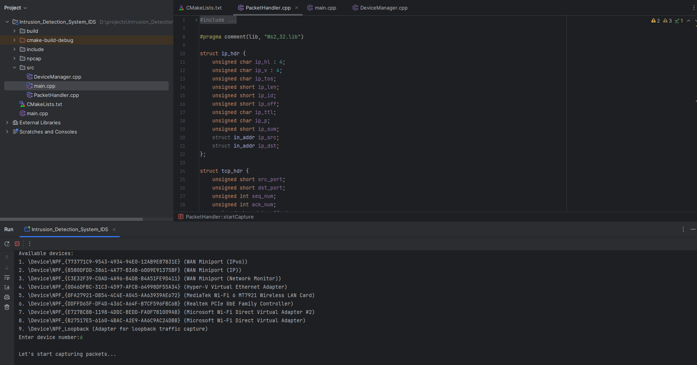
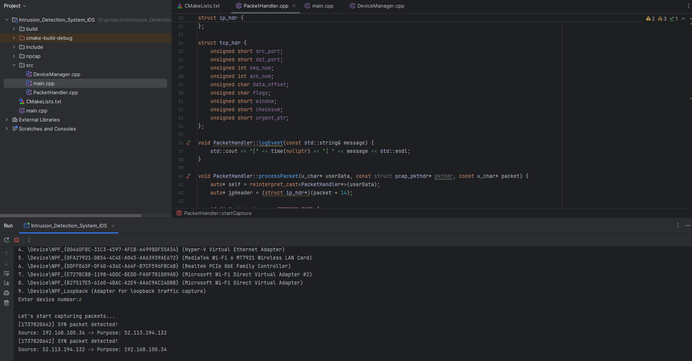

# 🛡️ Intrusion Detection System (IDS)

**Version**: 1.0.1

## 📖 Overview

This project is a **Network Intrusion Detection System (IDS)** designed to monitor incoming and outgoing network packets in real-time. It detects and logs suspicious activity, such as TCP SYN packets, which are often indicative of port scanning or DoS attacks.

The system is implemented in **C++** and uses **Npcap** for packet capturing. It is a powerful tool for analyzing network traffic and enhancing cybersecurity defenses.

## ✨ Features

- **Real-Time Packet Monitoring**: Captures and analyzes live network traffic with precision and speed.
- **Intrusion Detection**: Advanced detection of specific packet types, focusing on potential security threats like TCP SYN packets.
- **Platform Compatibility**: Windows-based solution, developed using cutting-edge tools like `Npcap` and `CLion`.
- **Intuitive CLI Interface**: Simple and user-friendly command-line experience for seamless interaction.

## 📸 Screenshots

> Note: Actual screenshot paths need to be replaced with your repository's image links

1. **Initial Screen – Scanning Devices**
   
   *Before starting packet capture, the system scans available network interfaces.*

2. **Packet Transmission from Python**
   
   *Packets are sent using a Python script, simulating SYN packet activity.*

3. **Detected Packets in IDS**
   
   *The IDS logs the detected SYN packets in real time.*

## 🛠️ Installation

### 1. Prerequisites

- **Windows OS**
- **CLion IDE**
- **Npcap**
- **CMake**
- **Python** (for testing)

### 2. Installation Steps

1. Clone the repository:
   ```bash
   git clone https://github.com/your-username/Intrusion_Detection_System_IDS.git
   cd Intrusion_Detection_System_IDS
   ```

2. Install **Npcap**:
    - Download and install the latest version from [Npcap Official Website](https://nmap.org/npcap/)
    - Ensure it is installed in `D:/projects/Intrusion_Detection_System_IDS/npcap`

3. Configure the build using CMake:
   ```bash
   cmake -S . -B build
   cmake --build build
   ```

4. Run the executable:
   ```bash
   ./build/Intrusion_Detection_System_IDS.exe
   ```

5. (Optional) Use the Python script for testing:
   ```python
   from scapy.all import *
   
   target_ip = "192.168.1.100"  # Replace with IDS machine IP
   packet = IP(dst=target_ip)/TCP(dport=80, flags="S")
   send(packet, count=100)
   ```

## ⚙️ How to Use

1. **Launch the IDS**: Run the executable file. The system will scan and list available network interfaces.
2. **Select Interface**: Enter the interface number where you want to monitor traffic.
3. **Start Monitoring**: The system will begin monitoring packets and display detected SYN packets in real-time.
4. **Test Detection**: Use the provided Python script to send packets and verify IDS detection.

## 🛡️ Built With


## 🚀 Future Enhancements

- [ ] Add support for additional network protocols
- [ ] Implement advanced alert notifications for suspicious activities
- [ ] Enhance the user interface with a graphical dashboard
- [ ] Integrate machine learning for more intelligent threat detection

## 📜 License

This project is licensed under the **MIT License**. See the [LICENSE](LICENSE) file for details.

## 💬 Contact

Have questions or feedback? Feel free to reach out!

- **Email**: ymarumar502@gmail.com
- **GitHub**: [scrollDynasty](https://github.com/scrollDynasty)

---

**Contributions are welcome!** 🌟 Please read the contributing guidelines before getting started.