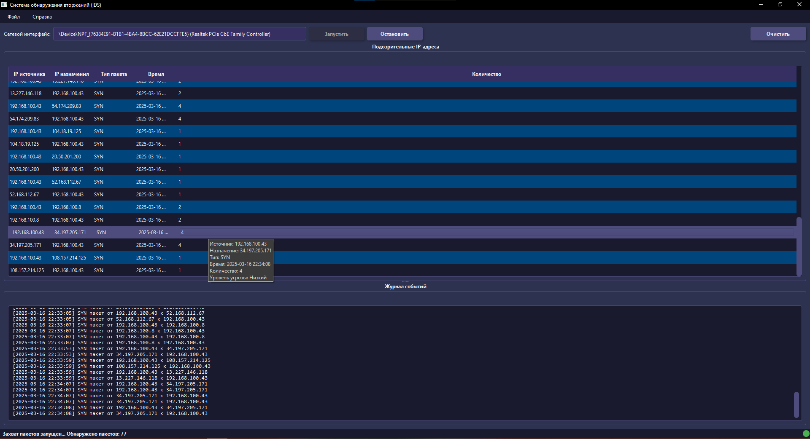
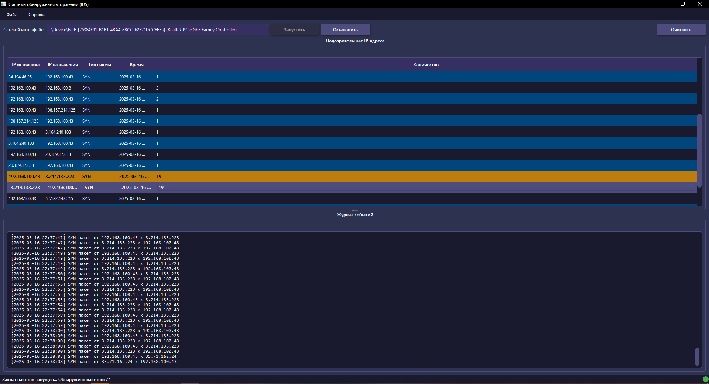
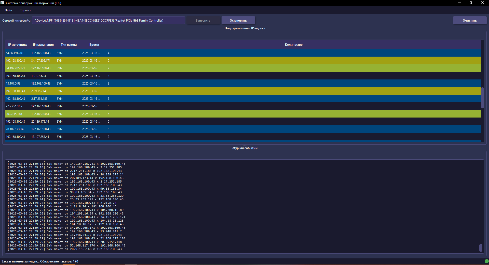

# 🛡️ Intrusion Detection System (IDS)

<div align="center">


</div>

## 📖 Обзор

**Intrusion Detection System (IDS)** — это система обнаружения вторжений с графическим интерфейсом, разработанная на C++ с использованием Qt. Система мониторит входящие и исходящие сетевые пакеты в реальном времени, обнаруживает и регистрирует подозрительную активность, такую как TCP SYN-пакеты, которые часто указывают на сканирование портов или DoS-атаки.

## 🚀 Быстрый старт

### ⚡ Готовый исполняемый файл

Для быстрого начала работы вы можете скачать готовый исполняемый файл из [раздела релизов](https://github.com/scrollDynasty/Intrusion_Detection_System_IDS/releases). Просто распакуйте архив и запустите `Intrusion_Detection_System_IDS.exe` — никаких дополнительных установок не требуется!

> **Примечание:** Готовый исполняемый файл содержит все необходимые библиотеки и может быть запущен на любом компьютере с Windows без установки Qt или других зависимостей.

## ✨ Новые функции и улучшения в версии 3.0.0

### 🎨 Современный пользовательский интерфейс
- **Темная тема** — улучшенная читаемость и снижение нагрузки на глаза
- **Цветовая индикация угроз** — визуальное выделение подозрительных IP-адресов:
  - 🔴 **Красный** — критический уровень (более 20 пакетов)
  - 🟠 **Оранжевый** — высокий уровень (более 10 пакетов)
  - 🟡 **Желтый** — средний уровень (более 5 пакетов)
- **Индикатор статуса** — визуальное отображение активности захвата пакетов
- **Всплывающие подсказки** — детальная информация о записях при наведении курсора
- **Автоматическое изменение размеров колонок** — улучшенное отображение данных в таблицах
- **HTML-форматирование логов** — цветовое выделение подозрительных пакетов в логе

### 🔍 Улучшенное обнаружение вторжений
- **Расширенная классификация пакетов** — более точное определение типов пакетов (TCP SYN, TCP ACK, TCP FIN, TCP RST, UDP, ICMP)
- **Улучшенный анализ трафика** — обнаружение аномалий в сетевом трафике
- **Подробное логирование** — HTML-форматирование логов с цветовой индикацией типов пакетов
- **Обнаружение сканирования портов** — анализ TCP SYN пакетов на привилегированные порты (< 1024)
- **Обнаружение попыток подключения к уязвимым сервисам** — мониторинг подключений к SMB, RDP, SSH, Telnet, MS SQL, MySQL
- **Обнаружение UDP и ICMP флуда** — анализ частоты пакетов на известные порты

### 🧪 Тестовый режим
- **Генерация тестового трафика** — возможность тестирования функциональности без реального сетевого трафика
- **Тестовый адаптер** — специальный режим работы без необходимости прав администратора
- **Различные типы тестовых пакетов** — генерация TCP, UDP и ICMP пакетов с различными параметрами
- **Симуляция угроз** — генерация подозрительных пакетов для тестирования системы обнаружения

### 🛡️ Повышенная стабильность
- **Обработка исключений** — предотвращение сбоев приложения при возникновении ошибок
- **Улучшенная обработка ошибок** — информативные сообщения об ошибках в логах
- **Безопасное завершение захвата** — корректное освобождение ресурсов при остановке захвата
- **Счетчики пакетов** — отображение количества обнаруженных и подозрительных пакетов в статусной строке

### 🐳 Поддержка Docker
- **Кросс-платформенность** — запуск на Linux, Windows и macOS без установки зависимостей
- **Простота развертывания** — автоматизированные скрипты для запуска на разных платформах
- **Изоляция окружения** — работа в изолированном контейнере для повышения безопасности

### 📦 Портативность
- **Автономный режим** — работа без установки дополнительных библиотек
- **Скрипт развертывания** — автоматическое создание портативной версии приложения
- **Совместимость** — работа на различных версиях Windows без дополнительных настроек

## 📸 Скриншоты

<div align="center">
  
  <p><em>Главное окно приложения с темной темой и мониторингом сетевой активности</em></p>
  
  
  <p><em>Анализ подозрительных пакетов с цветовой индикацией уровней угрозы</em></p>
  
  
  <p><em>Обнаружение и классификация сетевых угроз в реальном времени</em></p>
</div>

## 🚀 Установка и запуск

### 🪟 Windows

#### Вариант 1: Использование готового исполняемого файла (рекомендуется)
1. Скачайте последний релиз из [раздела релизов](https://github.com/scrollDynasty/Intrusion_Detection_System_IDS/releases)
2. Распакуйте архив в любую директорию
3. Запустите `Intrusion_Detection_System_IDS.exe`

#### Вариант 2: Сборка из исходного кода
1. Установите [Qt 6.8.2](https://www.qt.io/download)
2. Установите [CMake](https://cmake.org/download/)
3. Установите [MinGW](https://www.mingw-w64.org/downloads/) или [Visual Studio](https://visualstudio.microsoft.com/downloads/)
4. Установите [Npcap](https://nmap.org/npcap/) (обязательно выберите опцию "Install Npcap in WinPcap API-compatible Mode")
5. Клонируйте репозиторий и соберите проект:
```cmd
:: Клонирование репозитория
git clone https://github.com/scrollDynasty/Intrusion_Detection_System_IDS.git
cd Intrusion_Detection_System_IDS

:: Сборка проекта с MinGW
mkdir cmake-build-debug
cd cmake-build-debug
cmake .. -G "MinGW Makefiles"
cmake --build .

:: Создание портативной версии
cd ..
.\deploy.bat

:: Запуск приложения
.\deploy\Intrusion_Detection_System_IDS.exe
```

#### Вариант 3: Запуск через Docker
1. Установите [Docker Desktop для Windows](https://www.docker.com/products/docker-desktop)
2. Установите [VcXsrv Windows X Server](https://sourceforge.net/projects/vcxsrv/)
3. Запустите скрипт `run_docker.bat`

### 🐧 Linux

#### Установка зависимостей
```bash
# Установка Qt и других зависимостей
sudo apt-get update
sudo apt-get install -y build-essential cmake libpcap-dev qt6-base-dev libqt6widgets6 libqt6gui6 libqt6core6 libqt6network6
```

#### Сборка из исходного кода
```bash
# Клонирование репозитория
git clone https://github.com/scrollDynasty/Intrusion_Detection_System_IDS.git
cd Intrusion_Detection_System_IDS

# Сборка проекта
mkdir -p cmake-build-debug
cd cmake-build-debug
cmake ..
cmake --build .

# Запуск приложения
./Intrusion_Detection_System_IDS
```

#### Запуск через Docker
```bash
# Установка Docker и docker-compose
sudo apt-get install -y docker.io docker-compose
sudo usermod -aG docker $USER  # Требуется перезагрузка или выход/вход в систему

# Запуск приложения
chmod +x run_docker.sh
./run_docker.sh
```

### 🍎 macOS

#### Установка зависимостей
```bash
# Установка Homebrew (если не установлен)
/bin/bash -c "$(curl -fsSL https://raw.githubusercontent.com/Homebrew/install/HEAD/install.sh)"

# Установка Qt и других зависимостей
brew install cmake qt@6 libpcap

# Добавление Qt в PATH
echo 'export PATH="/usr/local/opt/qt@6/bin:$PATH"' >> ~/.zshrc
source ~/.zshrc
```

#### Сборка из исходного кода
```bash
# Клонирование репозитория
git clone https://github.com/scrollDynasty/Intrusion_Detection_System_IDS.git
cd Intrusion_Detection_System_IDS

# Сборка проекта
mkdir -p cmake-build-debug
cd cmake-build-debug
cmake ..
cmake --build .

# Запуск приложения
./Intrusion_Detection_System_IDS
```

#### Запуск через Docker
```bash
# Установка Docker Desktop для Mac
brew install --cask docker

# Установка XQuartz
brew install --cask xquartz

# Запуск приложения
chmod +x run_docker_mac.sh
./run_docker_mac.sh
```

## 📦 Создание портативной версии

Для создания портативной версии приложения, которую можно запускать на любом компьютере с Windows без установки дополнительных библиотек, используйте скрипт `deploy.bat`:

```cmd
:: Запуск скрипта развертывания
.\deploy.bat
```

Скрипт создаст директорию `deploy` со всеми необходимыми файлами. Вы можете архивировать эту директорию и распространять её как портативную версию приложения.

## 🐳 Docker: подробное руководство

### Преимущества использования Docker
- **Единое окружение** — одинаковая среда выполнения на всех платформах
- **Отсутствие конфликтов зависимостей** — изолированное окружение для приложения
- **Простота развертывания** — не требуется установка Qt и других библиотек

### Структура Docker-файлов
- **Dockerfile** — основной файл для создания образа
- **docker-compose.yml** — конфигурация для запуска контейнера
- **run_docker.sh** — скрипт запуска для Linux
- **run_docker.bat** — скрипт запуска для Windows
- **run_docker_mac.sh** — скрипт запуска для macOS

### Запуск на разных платформах

#### Linux
```bash
# Разрешение выполнения скрипта
chmod +x run_docker.sh

# Запуск
./run_docker.sh
```

#### Windows
```cmd
:: Запуск из командной строки
run_docker.bat

:: Или двойным щелчком по файлу run_docker.bat
```

#### macOS
```bash
# Разрешение выполнения скрипта
chmod +x run_docker_mac.sh

# Запуск
./run_docker_mac.sh
```

### Возможные проблемы и их решение

#### Проблемы с отображением GUI
- **Linux**: Убедитесь, что вы разрешили доступ к X-серверу: `xhost +local:docker`
- **Windows**: Проверьте, что VcXsrv запущен с параметрами `-multiwindow -clipboard -wgl`
- **macOS**: Убедитесь, что XQuartz запущен и разрешены подключения: `xhost +localhost`

#### Проблемы с доступом к сетевым интерфейсам
- Для работы с сетевыми интерфейсами контейнер должен быть запущен с привилегированным доступом (`privileged: true` в docker-compose.yml)
- На Windows может потребоваться запуск Docker Desktop от имени администратора

## 💻 Использование приложения

### Основные функции
1. **Выбор сетевого интерфейса** — выберите интерфейс для мониторинга из списка доступных
2. **Запуск/остановка захвата пакетов** — управление процессом мониторинга
3. **Просмотр подозрительных IP-адресов** — таблица с информацией о подозрительной активности
4. **Просмотр логов** — детальная информация о захваченных пакетах

### Интерпретация результатов
- **Цветовая индикация** — помогает быстро идентифицировать уровень угрозы
- **Счетчик пакетов** — показывает количество пакетов от конкретного IP-адреса
- **Временные метки** — время обнаружения подозрительной активности
- **Типы пакетов** — классификация пакетов по типу (SYN, ACK, FIN и т.д.)

## 🛠️ Технические детали

### Архитектура приложения
- **Модуль захвата пакетов** — использует libpcap/Npcap для захвата сетевого трафика
- **Модуль анализа** — обрабатывает захваченные пакеты и выявляет подозрительную активность
- **Модуль визуализации** — отображает результаты анализа в удобном для пользователя виде
- **Модуль логирования** — сохраняет информацию о захваченных пакетах и обнаруженных угрозах

### Используемые технологии
- **C++17** — основной язык программирования
- **Qt 6.8.2** — фреймворк для создания графического интерфейса
- **libpcap/Npcap** — библиотека для захвата сетевых пакетов
- **CMake** — система сборки
- **Docker** — контейнеризация приложения

## 🔮 Планы на будущее

- [ ] **Расширенная аналитика** — добавление статистики и графиков для анализа трафика
- [ ] **Система оповещений** — уведомления о подозрительной активности
- [ ] **Экспорт данных** — возможность экспорта результатов анализа в различные форматы
- [ ] **Профили мониторинга** — создание и сохранение различных профилей для мониторинга
- [ ] **Интеграция с базами данных угроз** — проверка IP-адресов по базам известных угроз

## 📜 Лицензия

Этот проект распространяется под лицензией **MIT**. Подробности смотрите в файле [LICENSE](LICENSE).

## 💬 Контакты

Есть вопросы или предложения? Свяжитесь с нами!

- **Email**: ymarumar502@gmail.com
- **GitHub**: [scrollDynasty](https://github.com/scrollDynasty)

---

<div align="center">
  <p>Разработал scrollDynasty</p>
  <p>© 2024-2025 Intrusion Detection System</p>
</div>